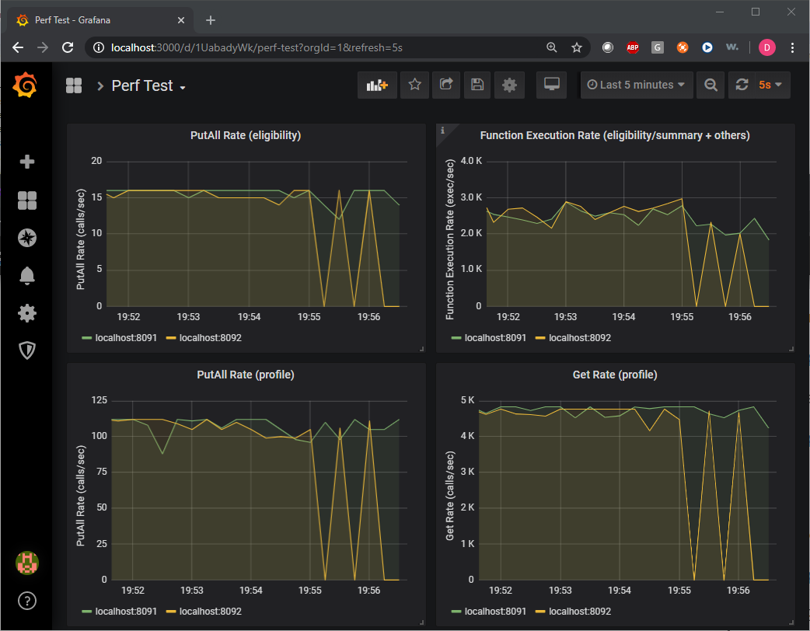

# Apache Geode/Pivotal GemFire Addon Distribution

The `geode-addon` repo contains Apache Geode/Pivotal GemFire specific tools and addons that supplement the Apache Geode/Pivotal GemFire products.

## Addon Components

The `geode-addon` distribution includes the following components:

1. [Addon Library](geode-addon-core/README.md)
2. [Cluster Lifecycle Management Scripts](geode-addon-deployment/src/main/resources/bin_sh/)
3. [Vagrant Pods](geode-addon-deployment/src/main/resources/pods/)
4. [VMs (AWS, Azure, GCP, etc)](doc/VMs.md)
5. [Apps](geode-addon-deployment/src/main/resources/apps/)
   1. [Grafana](geode-addon-deployment/src/main/resources/apps/grafana)
   2. [perf_test](geode-addon-deployment/src/main/resources/apps/perf_test)
6. [Bundles](#understanding-bundles)

## Examples

The following is a list of examples provided to help you get familiar with `geode-addon`.

- [Quick Start](#Quick-Start) - Quick-start `geode-addon` installation and data ingestion instructions.
- [Database Integration](geode-addon-deployment/src/main/resources/apps/perf_test#mapstorepkdbimpl-database-integration) - A generic DB addon that connects to any database via Hibernate.

## Supported Geode/GemFire Versions

`geode-addon` fully supports both [Geode 1.x](https://geode.apache.org/) and [GemFire 9.x](https://pivotal.io/pivotal-gemfire).

## Building geode-addon

If you want to generate man pages then execute `build_dist`.sh. This is the recommended way to build the `geode-addon` distribution.

```console
./build_dist.sh
```

You can also execute `mvn` as follows but it will *not* include man pages.

```console
mvn install
```

Both commands generate the following distribution files:

```console
# The following distributions contain all the geode-addon components.
geode-addon-deployment/target/assembly/geode-addon_<version>.tar.gz
geode-addon-deployment/target/assembly/geode-addon_<version>.zip
```

## Building geode-addon-all

To keep the distribution file size minimal, by default, most of the apps do not include the required binary files. You can build these apps when you install them later by running their `build_app` scripts. If your users do not have the Internet access then you can build the apps now by running the `build_all.sh` script, which generates the `geode-addon-all_<version>.targ.gz` file that includes all of the apps that are fully compiled and packaged.

```console
./build_all.sh
```

The `build_all.sh` command generates the following distribution files:

```console
geode-addon-deployment/target/assembly/geode-addon-all_<version>.tar.gz
geode-addon-deployment/target/assembly/geode-addon-all_<version>.zip
```

## Building and Running on Windows - Cygwin

`geode-addon` fully supports Cygwin. Make sure to include the `curl` command when installing Cygwin. It is required by some of the commands and apps.

[Cygwin: https://cygwin.com/](https://cygwin.com/)

## Deploying geode-addon

Inflate one of the distribution files in your file system. For example,

```console
tar -C ~/Geode/ -xzf geode-addon_0.9.0-SNAPSHOT.tar.gz
cd ~/Geode
tree -L 1 geode-addon_0.9.0-SNAPSHOT
geode-addon_0.9.0-SNAPSHOT
├── LICENSE
├── NOTICE
├── README.md
├── RELEASE_NOTES.txt
├── apps
├── bin_sh
├── clusters
├── etc
├── lib
├── plugins
└── pods
```

## Building Apps

The `geode-addon_<version>` distribution contains apps which you may required to build before you can run them. These apps are identifiable if their `bin_sh` directory contains the `build_app` command. You can simply run this command to build the app as shown in the example below.

```console
cd_app perf_test; cd bin_sh
./build_app
```

[Go To Apps](geode-addon-deployment/src/main/resources/apps/)

## Quick Start

The `geode-addon` installation process has been simplified by introducing the concept of workspace. A workspace is essentially a directory in which `geode-addon` runs all of its commands. All of your work is stored in the workspace. It is completely isolated and detached from the `geode-addon` directory providing the freedom to make changes without interfering with `geode-addon` and other workspaces. You can have any number of workspaces and run multiple workspaces at the same time.

Workspaces are consolidated under a single directory specified by the `GEODE_ADDON_WORKSPACES_HOME` environment variable. This variable is automatically set when you initialize the `geode-addon` environment by running the `init_geode_addon` command. The workspace consolidation provides a simple and quick way to switch between workspaces by executing the `switch_workspace` command. There are other convenience commands such as `cd_workspace` to change directory to the specified workspace, `list_workspace` to list all workspaces, and etc.

`geode-addon` supports both Geode and GemFire distributions. Make sure to install one of them and JDK before proceeding with the `geode-addon` quick-start steps shown below.

- [JDK 1.8_121+](https://www.oracle.com/technetwork/java/javase/downloads/index.html)
- [Geode](https://geode.apache.org/releases/) - Open source.
- [GemFire](https://network.pivotal.io/products/pivotal-gemfire) - Pivotal GemFire.

You can install `geode-addon` anywhere in the file system. The `init_geode_addon` command interactively guides you through the installation process. The following example installs `geode-addon` in the `~/Geode` directory. 

```console
# 1. Untar the geode-addon distribution tarball.
mkdir ~/Geode
tar -C ~/Geode/ -xzf geode-addon_0.9.0-SNAPSHOT.tar.gz

# 2. Initialize geode-addon. init_geode_addon is an interactive command
#    that prompts for the workspaces directory and required software 
#    installation paths. Note that the -path option is specified for our demo.
~/Geode/geode-addon_0.9.0-SNAPSHOT/bin_sh/init_geode_addon -path ~/Geode/workspaces

# 3. Source in the workspaces initenv.sh file which sets your workspaces-wide environment
#    variables. If you want to make this workspaces directory default then add the
#    following line ~/.bashrc, ~/.bash_profile, etc.
. ~/Geode/workspaces/initenv.sh

# 4. The 'init_geode_addon' command created the default workspace named 'myws' and
#    the default cluster named 'mygeode'. Let's switch to and start the 'mygeode' cluster.
switch_cluster mygeode
start_cluster

# 5. Create a copy of the default app, perf_test. To create other apps, use the '-app' option.
#    You can have more than one copy of the same app.
create_app

# 6. Change directory to perf_test and run its scripts to ingest mock data.
cd_app perf_test; cd bin_sh
./test_ingestion -run
./test_tx -run
```

The `geode-addon` distribution also includes out-of-the-box support for Grafana and Prometheus. You can monitor the cluster using the included `grafana` app.

[Go To Grafana App](geode-addon-deployment/src/main/resources/apps/grafana)

## Managing Geode/GemFire Clusters

The `bin_sh` directory contains scripts for managing multiple clusters on you local and remote machines. These scripts allow you to safely create multiple clusters and operate them independently.

### Installing `geode-addon`

Inflate the `geode-addon` tarball in your file system. For our example, let's inflate it in `~/Geode/`.

```console
tar -C ~/Geode/ -xzf geode-addon_0.9.0-SNAPSHOT.tar.gz
tree -L 2 ~/Geode
/Users/dpark/Geode
└── geode-addon_0.9.0-SNAPSHOT
    ├── LICENSE
    ├── NOTICE
    ├── README.md
    ├── RELEASE_NOTES.txt
    ├── apps
    ├── bin_sh
    ├── clusters
    ├── etc
    ├── lib
    ├── plugins
    └── pods
```

### Initializing `geode-addon`

1. Initialize `geode-addon` environment. This is an interactive command. Enter valid values for all prompts.

```console
~/Geode/geode-addon_0.9.0-SNAPSHOT/init_geode_addon -path ~/Geode/workspaces
```
2. Source in the generated `initenv.sh` file. `initenv.sh` sets the required environment variables including `PATH`.

```console
. ~/Geode/workspaces/initenv.sh
```

3. Add the above line to `.bashrc` (.bash_profile, etc) so that the required environment variables are automatically set when you login next time. 

```console
echo ". ~/Geode/workspaces/initenv.sh" >> ~/.bashrc
echo ". ~/Geode/workspaces/initenv.sh" >> ~/.bash_profile
```

### Understanding Workspaces

Once you switched into a workspace, you are able to run all the `geode-addon` features completely isolated from other workspaces and `geode-addon` versions. All of your work is stored in the workspace directory. You can think of a workspace as a sandbox in which you can safely create clusters, apps, and bundles without affecting other workspaces. Workspaces typically have the following directory structure.

```console
myws
├── .addonenv.sh
├── apps
│   ├── README.md
│   ├── desktop
│   ├── grafana
│   └── perf_test
├── clusters
├── initenv.sh
├── pods
└── setenv.sh
```

Every workspace comes with the following shell files. They contain environment variables that are specific to the workspace.

#### Workspace `setenv.sh`

In `setenv.sh`, you can override or introduce new environment variables. This file is imported by all `geode-addon` commands allowing you to set or override workspace-wide environment variables. The following environment variables are typically set in this file.

| Environment Variables | Descriptions |
| --------------------- | ------------ |
| JAVA_HOME             | JDK home directory path. |
| GEODE_HOME            | Geode/GemFire home directory path. |
| GEODE_ADDON_HOME      | `geode-addon` home directory path. This path is automatically set when you create a workspace. You can change this to another `geode-addon` installation as needed. |
| CLUSTER               | The default cluster name so that you can avoid using the `-cluster` command option. |
| POD                   | The default pod name so that you can avoid using the `-pod` command option. |
| JAVA_OPTS             | Additional Java options for running cluster members. |
| CLASSPATH             | Additional class paths for running cluster members. |

#### Workspace `initenv.sh`

This file imports `setenv.sh` to set the environment variables and enables bash command completion. The `switch_workspace` command sources in this file to set the workspace environment variables.

#### Workspace `.addenv.sh`

This hidden file sets the `GEODE_ADDON_WORKSPACE` environment variable to the workspace directory path. This is the single most important environment variable for managing workspaces. You should never modify this file.

| Environment Variables     | Descriptions              |
| ------------------------- | ------------------------- |
| GEODE_ADDON_WORKSPACE     | Workspace directory path. |

#### Bash Auto-Completion

`geode-addon` supports bash auto-completion. All the options can be auto-completed by typing the tab key twice, i.e., `<tab><tab>`. For example, the main command, `geode_addon`, displays all the supported sub-commands as follows:

```console
geode_addon <tab><tab>
add_locator     create_pod        list_workspaces  show_mc             stop_member
add_member      create_script     pwd_cluster      show_pod            stop_pod
add_node        create_workspace  pwd_workspace    show_workspace      stop_workspace
backup_addon    geode_addon       remove_app       shutdown_cluster    switch_cluster
build_pod       init_geode_addon  remove_cluster   shutdown_workspace  switch_workspace
cd_app          install_bundle    remove_locator   start_cluster       vm_copy
cd_cluster      kill_cluster      remove_member    start_locator       vm_deploy_addon
cd_pod          kill_locator      remove_node      start_mc            vm_deploy_bundle
cd_workspace    kill_member       remove_pod       start_member        vm_exec
clean_cluster   kill_workspace    setenv.sh        start_pod
create_app      list_apps         show_bundle      stop_cluster
create_bundle   list_clusters     show_cluster     stop_locator
create_cluster  list_pods         show_log         stop_mc
```

:exclamation: There is a well-known bash auto-completion bug in macOS that prepends a backslash if you hit the tab key followed by an environment variable. If this happens to you then a workaround is to add the following command in `.bashrc` or `.bash_profile`. *Note that this is a macOS bash bug and is NOT contributed by `geode-addon`.*

```bash
# Fixes bash auto-complete bug that prepends '\' to env variables
shopt -s direxpand
```

### Understanding Clusters

Under each workspace, you can create one or more Geode/GemFire clusters. A cluster is created by running the `create_cluster` command which by default adds one (1) locator and two (2) members. You can add more locators and members by using the `add_locator` and `add_member` commands, respectively.

You can set default values for cluster and pod using environment variables in a login shell or in `<workspace-dir>/setenv.sh`. If the `-cluster` or `-pod` options are not specified then the `geode-addon` commands default to these environment variables.

| Environment Variables     | Descriptions             | Default |
| ------------------------- | ------------------------ | ------- |
| CLUSTER                   | Default cluster name. If the `-cluster` is not specified then the `geode-addon` commands default to this value. | N/A  |
| POD                       | Default pod name. If the `-pod` option is not specified then the `geode-addon` commands default to this value. | `local` |

#### Cluster `setenv.sh`

Setting cluster specific environment variables such as `JAVA_OPTS` is done by adding them in `<cluster-dir>/setenv.sh`, which is sourced in by all `geode-addon` commands after the workspace `setenv.sh` is sourced in. This means you can override workspace-level cluster settings from this file.

```console
# Add or override cluster specific settings in the following file:
vi $GEODE_ADDON_WORKSPACE/clusters/$CLUSTER/bin_sh/setenv.sh
```

Similarly, the above file can be reached by using the `cd_cluster` command.

```console
cd_cluster
vi bin_sh/setenv.sh
```

#### Default Member Startup

By default, `geode-addon` runs each locator and member using the `gfsh` command as shown below.

```bash
# locator
gfsh start locator ...

# member/server
gfsh start server ...
```

#### Custom Member Startup Classes: `RUN_SCRIPT`

You can also use a custom class to start members by creating a script and setting the `RUN_SCRIPT` environment variable to the script's path in the `setenv.sh` file. You would normally place the script in the same cluster's `bin_sh/` directory where the `setenv.sh` is located. The custom script inherits environment variables.

- `JAVA` - Java executable
- `JAVA_OPTS` - Java options
- `GFSH_OPTS` - gfsh options
- `CLASSPATH` - Java class paths

The script can use the above environment variables to start the application as shown in the example below. Note that the member automatically runs in the background.

```bash
#!/usr/bin/env bash

"$JAVA" -server $JAVA_OPTS com.newco.mycluster.MyServer
```

You would set the script path in the `setenv.sh` file as follows:

```bash
# In setenv.sh
RUN_SCRIPT=$CLUSTER_DIR/bin_sh/your-script
```

### Running Cluster

Let's experiment some of the `geode-addon` commands in `myws` we created in the previous section. Please note that all the commands apply to both Geode and GemFire clusters.

1. Let's create a new cluster called `finance`.

```console
create_cluster -cluster finance
```

2. By default, the `create_cluster` command adds one (1) locator and two (2) members. If you want to add more members to the cluster then execute the `add_member` command. Let's add three (3) more members.

```console
add_member -cluster finance
add_member -cluster finance
add_member -cluster finance
```

3. The above command adds three (3) more members making the cluster size of five (5) members. The `show_cluster` command will display locator and member running status.

```console
show_cluster -cluster finance
```

4. If you are tired of typing the `-cluster` option then you can switch into the cluster.

```console
switch_cluster finance
```

5. With the switch_cluster command executed, you can now execute any commands without the `-cluster` option.

```console
show_cluster
```

6. The `create_cluster` command generates the `cluster.properties` file in the cluster's `etc` directory. You can edit this file to change values such as the heap min and max sizes.

```console
# First, change directory to the finance cluster directory
cd_cluster
cat etc/cluster.properties
```

7. Similarly, `create_cluster` places the `cache.xml` configuration file in the `etc` directory. You can edit it or replace it with your configuration file.

```console
cat etc/cache.xml
```

8. If you have application jar files that need to be in the member's class path, then place them in any of the `plugins` directory. See the [CLASSPATH](#classpath) section for the class path order.

```console
# By absolute paths
ls $GEODE_ADDON_WORKSPACE/clusters/$CLUSTER/plugins/
ls $GEODE_ADDON_WORKSPACE/plugins/

# By relative paths
cd_workspace
ls clusters/$CLUSTER/plugins/
ls plugins/
```

9. Once you are satisfied with the cluster configuration, you can now start the cluster using the `start_cluster` command. Note that this command starts both locators and members.

```console
start_cluster
```

10. You can execute the `show_cluster` command to see the cluster status. 

```console
# Specify the `-long` option to see cluster details
show_cluster -long
```

11. To view member log files, run the `show_log` command.

```console
# "tail -f" the first member log (-num 1)
show_log

# "tail -f" the second member log
show_log -num 2

# "less" the first meber log
show_log -full
```

12. You can shutdown, stop, or kill each locator, member, cluster, or workspace. For example, `kill_workspace -all` kills all running locators and members of all clusters in the current workspace. For our example, let's stop the cluster.

```console
# To stop members only
stop_cluster

# To stop both locators and members
stop_cluster -all
```

[Go To Cluster Lifecycle Management Scripts](geode-addon-deployment/src/main/resources/bin_sh/)

### Understanding Apps

`geode-addon` includes support for integrated apps that can readily be run in workspaces. Apps are provided as part of the `geode-addon` distribution and part of bundles. Each app comes with instructions and is preconfigured to run along side Geode/GemFire clusters.

[Go To Apps](geode-addon-deployment/src/main/resources/apps/)

### Running Apps

Before you can run apps, you must first install them by executing the `create_app` command.

```console
create_app -app perf_test -name my_perf_test
```

The above example installs the `perf_test` app in the `my_perf_test` folder. You can change directory into that folder using the `cd_app` command and run the app using one of the scripts provided in the `bin_sh` directory.

```console
cd_app my_perf_test; cd bin_sh
./test_ingestion -run
```

Each app comes with `README.md` which provides detailed instructions. For some apps, you may need to build them before you can execute them. In that case, you will see the `bin_sh/build_app` command. Simply run that command and it will automatically download the necessary files and build the app environment for you. For example, if you want to integrate Geode/GemFire with a database then you must build the `perf_test` app as shown in the example below.

```console
# Create and build perf_test
create_app -app perf_test -name perf_test_db
cd_app perf_test_db; cd bin_sh
./build_app
```

### Deploying Cluster to Geode/GemFire Distribution Environment

Any clusters you created can be deployed in the Geode/GemFire distribution environment by generating a cluster deployment snapshot in the form of a tarball using the `create_script` command as shown in the example below. A cluster depolyment snapshot is completely free of `geode-addon` dependency. It does not require `geode-addon` and runs on its own in a vanilla Geode/GemFire environment.

```console
# Generate a finance cluster deployment snapshot.
create_script -cluster finance

...
Script tarball generated:
 /Users/dpark/Geode/workspaces/myws/clusters/finance/generated/README.txt
 /Users/dpark/Geode/workspaces/myws/clusters/finance/generated/finance.tar.gz
 
See 'README.txt' (also included in the tarball) for instructions.
```

The above example generates the `finance.tar.gz` file that contains all the configuration, binaries, and scripts needed to run the `finance` cluster in the Geode/GemFire distribution environment. The deployment instructions are provided in the generated `README.txt` file.

### Understanding Bundles

If you want to share your workspace configuration with other users then you can simply create a bundle that includes the required artifacts using the `create_bundle` command. The created bundle can then be installed by other users by executing the `install_bundle` command. A bundle is essentially an archive file (tarball) that contains all the required artifacts for reinstating the exact workspace environment that you captured at the time of bundle creation. You can think of it as a workspace snapshot. 

The [`geode-addon-bundles`](https://github.com/javapark1/geode-addon-bundles) repo provides bundles with preconfigured clusters, pods, and apps that are readily runnable in your `geode-addon` workspace environment. You can use the `install_bundle` command to quickly download, install, and run remote bundles in a matter of seconds. For example, the following installs the bundle that comes with scripts for integrating Geode/GemFire with databases.

```console
# List the available bundles with short descriptions
show_bundle -header

# View bundle instructions
show_bundle bundle-geode-1.11.0-cluster-app-mysql-perf_test_mysql.tar.gz

# Install bundle
install_bundle -download bundle-geode-1.11.0-cluster-app-mysql-perf_test_mysql.tar.gz
```

Please see the usage by running one of the following:

```console
# Display man page
man install_bundle

# Display help (same info as man page)
install_bundle -?
```

[Go To `geode-addon-bundles`](https://github.com/javapark1/geode-addon-bundles)

## CLASSPATH

The class path is defined in the following order:

```console
$CLASSPATH
$GEODE_ADDON_WORKSPACE/clusters/<cluster>/plugins/*
$GEODE_ADDON_WORKSPACE/clusters/<cluster>/lib/*
$GEODE_ADDON_WORKSPACE/plugins/*
$GEODE_ADDON_WORKSPACE/lib/*
$GEODE_ADDON_HOME/plugins/*
$GEODE_ADDON_HOME/lib/*
$GEODE_ADDON_HOME/plugins/v?/*
$GEODE_ADDON_HOME/lib/v?/*
$GEODE_HOME/lib/geode-enterprise-all-<version>.jar
$GEODE_HOME/user-lib/*
```

Note that `CLASSPATH` can be set in `setenv.sh` at each directory level to include additional paths or override any paths set in the subsequent directory levels. The `setenv.sh` files are located as follows:

```console
$GEODE_ADDON_WORKSPACE/clusters/<cluster>/bin_sh/setenv.sh
$GEODE_ADDON_WORKSPACE/setenv.sh
$GEODE_ADDON_HOME/bin_sh/setenv.sh
```

## About geode-addon-core

The `geode-addon` distribution includes a single jar file that contains reusable addon components that supplement the Geode/GemFire products. This jar file is found in the `lib` directory as follow:

```console
ls lib/geode-addon-core-*.jar
```

**IMPORTANT**: Note that if you are running external clients that require `geode-addon` services, then you must also include this jar file in that client's class path. For the integrated apps or the apps that are part of the distribution, this is already done for you.
 
## Software List

To run Geode/GemFire clusters and client apps, `geode-addon` requires only JDK and Geode/GemFire. If you want to take advantage of other features, you will need to install the additional software. A complete list of software is listed below.

| Product | For | URL |
| ------- | --- | ----------- |
| Grafana | Cluster monitoring| [https://grafana.com/grafana/download](https://grafana.com/grafana/download) |
| Geode | Geode clusters | [https://geode.apache.org/releases/](https://geode.apache.org/releases/) |
| Gemfire |Pivotal GemFire clusters | [https://network.pivotal.io/products/pivotal-gemfire)](https://network.pivotal.io/products/pivotal-gemfire) |
| JDK | Java | [https://www.oracle.com/technetwork/java/javase/downloads/index.html) ](https://www.oracle.com/technetwork/java/javase/downloads/index.html)|
| JQ | Grafana scripts that require JSON string parsing | [https://stedolan.github.io/jq](https://stedolan.github.io/jq) |
| Prometheus | Geode JMX metrics streaming to Granfana | [ https://prometheus.io/download]( https://prometheus.io/download) |
| Vagrant | Pod creation | [https://www.vagrantup.com/downloads.html](https://www.vagrantup.com/downloads.html) |
| VirtualBox | VMs | [https://www.virtualbox.org](https://www.virtualbox.org) |

For creating pods, it is recommended that you install the following products in the same directory. **Make sure to install the Linux versions.**

- Grafana
- Geode or GemFire
- JDK
- JQ
- Prometheus

By default, the pod builder, for example, looks for these products in the `$GEODE_ADDON_WORKSPACE/products` directory. For convenience, you can create a symbolic link to the actual directory where you installed the products. For example,

```console
# Make a directory where all products will be installed
mkdir ~/Work/linux
tar xzf -C ~/Work/linux -xzf ~/Downloads/grafana-6.2.5.linux-amd64.tar.gz
tar xzf -C ~/Work/linux -xzf ~/Downloads/geode-enterprise-3.12.5.tar.gz
tar xzf -C ~/Work/linux -xzf ~/Downloads/jdk-8u212-linux-x64.tar.gz
tar xzf -C ~/Work/linux -xzf ~/Downloads/prometheus-2.10.0.linux-amd64.tar.gz

# JQ download is the actual executable. Create a directory and rename it to jq.
mkdir ~/Work/linux/jq-1.6
chmod 755 ~/Downloads/jq-linux64 
mv ~/Downloads/jq-linux64 ~/Work/linux/jq-1.6/jq

# For convenience, create a symbolic link in the geode-addon directory
switch_workspace myws
ln -s ~/Work/linux products
```

For JQ, the binary download is the actual executable. You will need to create a directory and rename the downloaded binary to `jq` in that directory as described in the above example.

## Addon Features

### Pods

`geode-addon` brings the *pod* concept to your local environment by including support for automatically building and distributing Geode/GemFire clusters running on local VMs. Imagine a single command that builds and launches a pod with a Geode/GemFire cluster spanning several VMs. With this support, you can turn your laptop into a private cloud consisting of numerous pods hosting numerous Geode/GemFire clusters. Pods are ideal for developing and debugging applications, testing and evaluating products, tuning product performance, testing WAN replication, reproducing product issues, and even hosting applications for internal users.

Note that we define the term *addon pod* as a collection of VMs, whereas Kubernete's pod is a group of one or more containers. We typically run one Geode/GemFire member per VM and therefore an addon pod represents a cluster of Geode/GemFire members. Similarly, on Kubernetes, we typically run one Geode/GemFire member (or container) per Kubernetes pod and therefore a group of pods represents a cluster of Geode/GemFire members.

[Go To Pods](geode-addon-deployment/src/main/resources/pods/)

### Grafana

`geode-addon` works with Granfana and Prometheus out of the box. The `grafana` app includes perconfigured Grafana dashboards to monitor Geode/GemFire clusters and a set of scripts to import and export your custom dashboards.

[Go To Grafana](geode-addon-deployment/src/main/resources/apps/grafana)



### perf_test

The `perf_test` app provides a set of scripts to run performance tests on Geode/GemFire. You can create your own test cases to measure `Region` operations and function-based transactions performed in the cluster.

[Go To `perf_test`](geode-addon-deployment/src/main/resources/apps/perf_test)